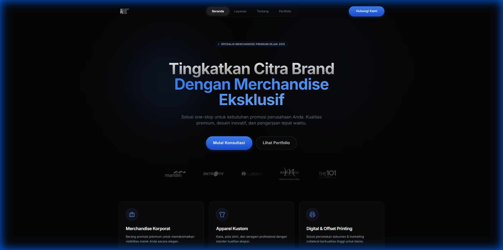
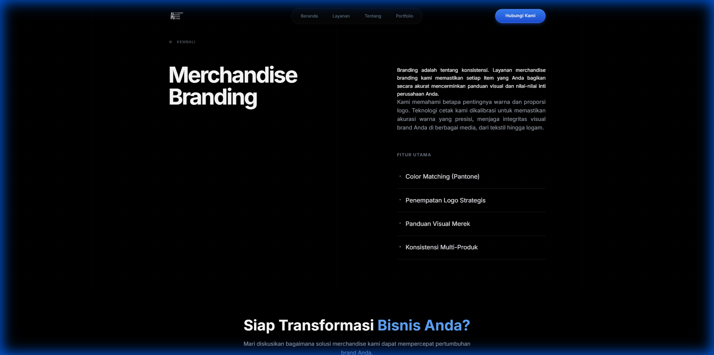
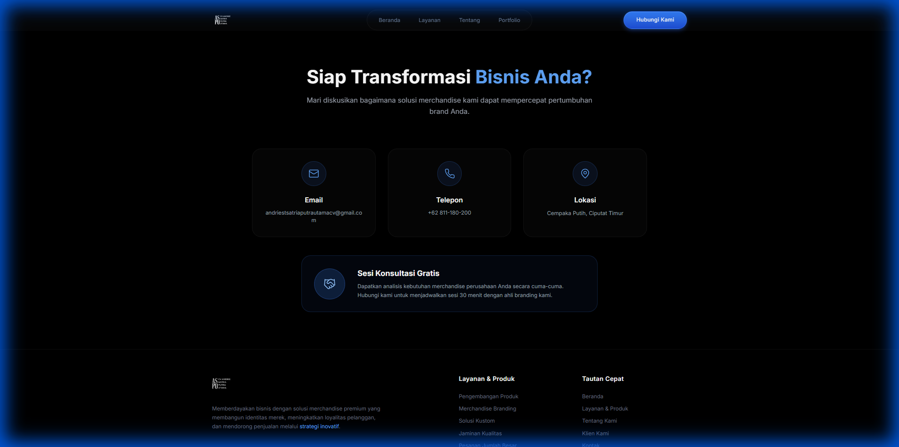
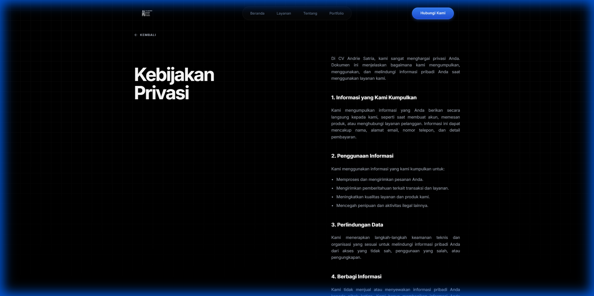

# CV Andrie Satria - Premium Merchandise & Branding Specialist


> **"Extravagance in Minimalism."** A high-performance, aesthetically pleasing portfolio website designed with an "Industrial Luxury" philosophy.

## 🌟 Overview

This project is a modern corporate portfolio for **CV Andrie Satria**, specializing in premium merchandise and exclusive branding. The website is built to reflect the company's core values: **Quality, Elegance, and Professionalism**.

The design language moves away from traditional corporate styles, embracing a **monolith, typography-driven aesthetic** with subtle grid backgrounds, sticky layouts, and a stark black-and-white palette.

## ✨ Key Features

-   **🎨 Industrial Luxury Design**: A bespoke design system focusing on large typography, negative space, and subtle details (grid patterns, glassmorphism).
-   **⚡ High Performance**: Built with Vite and React for ultra-fast loading and smooth transitions.
-   **📱 Fully Responsive**: Flawless experience across all devices, from large desktop monitors to mobile phones.
-   **🔍 SEO Optimized**: Semantic HTML and optimized assets for better search engine visibility.
-   **♿ Accessibility**: Considered accessible contrast ratios and semantic structure.
-   **🛠️ Modern Tech Stack**: Utilizing the latest ecosystem tools for reliability and scalability.

## 📸 Gallery

### Home Page - Hero Section
*The first impression. Bold, authoritative, and clean.*


### Services - Detail View
*Asymmetrical layout with sticky typography for immersive reading.*


### Contact Page
*Minimalist interface for high-value conversions.*


### Legal Pages (Privacy & Terms)
*Maintaining brand consistency even in formal documents.*


## 🛠️ Technology Stack

-   **Framework**: [React](https://reactjs.org/) (v18)
-   **Build Tool**: [Vite](https://vitejs.dev/)
-   **Language**: [TypeScript](https://www.typescriptlang.org/)
-   **Styling**: [Tailwind CSS](https://tailwindcss.com/)
-   **Animations**: [Framer Motion](https://www.framer.com/motion/)
-   **Icons**: [Lucide React](https://lucide.dev/)
-   **Routing**: [React Router DOM](https://reactrouter.com/)

## � Getting Started

To run this project locally, follow these steps:

### Prerequisites
-   Node.js (v18 or higher recommended)
-   npm or yarn

### Installation

1.  **Clone the repository**
    ```bash
    git clone https://github.com/rofiperlungoding/cvandriesatria.git
    cd cvandriesatria
    ```

2.  **Install dependencies**
    ```bash
    npm install
    # or
    yarn install
    ```

3.  **Start Development Server**
    ```bash
    npm run dev
    ```
    Open `http://localhost:5173` in your browser.

## � Build for Production

To create an optimized production build:

```bash
npm run build
```

The output will be in the `dist/` directory, ready to be deployed to Vercel, Netlify, or any static host.

## 📄 License

Matches the proprietary nature of the business. All rights reserved by **CV Andrie Satria**.

---
*Built with passion for quality.*
